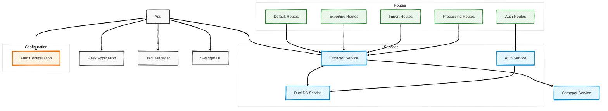

```mermaid
---
config:
  layout: fixed
  look: handDrawn
  theme: neo
---
flowchart TD
 subgraph Services["Services"]
        DuckDBService["DuckDB Service"]
        EMBRAPAExtractorService["Extractor Service"]
        AuthService["Auth Service"]
  end
 subgraph Routes["Routes"]
        ApiAuthRoutes["Auth Routes"]
        ApiDefaultRoutes["Default Routes"]
        ApiExportingRoutes["Exporting Routes"]
        ApiImportRoutes["Import Routes"]
        ApiProcessingRoutes["Processing Routes"]
  end
 subgraph Configuration["Configuration"]
        AuthConfig["Auth Configuration"]
  end
    App["App"] --> Flask["Flask Application"] & JWTManager["JWT Manager"] & SwaggerUI["Swagger UI"] & EMBRAPAExtractorService & AuthConfig
    EMBRAPAExtractorService --> DuckDBService & n1["Scrapper Service"]
    AuthService --> DuckDBService
    ApiAuthRoutes --> AuthService
    ApiDefaultRoutes --> EMBRAPAExtractorService
    ApiExportingRoutes --> EMBRAPAExtractorService
    ApiImportRoutes --> EMBRAPAExtractorService
    ApiProcessingRoutes --> EMBRAPAExtractorService
    n1@{ shape: rect}
     DuckDBService:::service
     EMBRAPAExtractorService:::service
     AuthService:::service
     ApiAuthRoutes:::route
     ApiDefaultRoutes:::route
     ApiExportingRoutes:::route
     ApiImportRoutes:::route
     ApiProcessingRoutes:::route
     AuthConfig:::config
     n1:::service
    classDef default fill:#f9f9f9,stroke:#333,stroke-width:2px
    classDef service fill:#e1f5fe,stroke:#0288d1,stroke-width:2px
    classDef route fill:#e8f5e9,stroke:#2e7d32,stroke-width:2px
    classDef config fill:#fff3e0,stroke:#ef6c00,stroke-width:2px
```